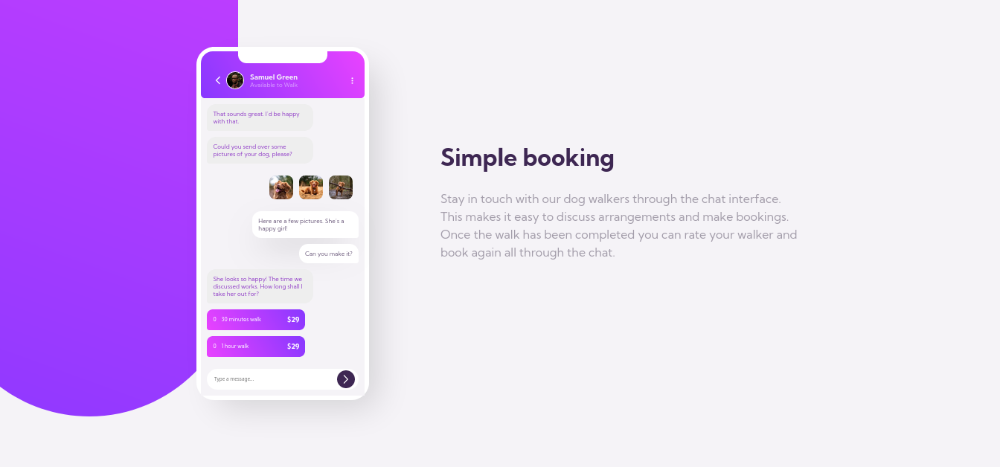

# Frontend Mentor - Chat app CSS illustration solution

This is a solution to the [Chat app CSS illustration challenge on Frontend Mentor](https://www.frontendmentor.io/challenges/chat-app-css-illustration-O5auMkFqY). Frontend Mentor challenges help you improve your coding skills by building realistic projects.

## Table of contents

- [Overview](#overview)
  - [The challenge](#the-challenge)
  - [Screenshot](#screenshot)
  - [Links](#links)
- [My process](#my-process)
  - [Built with](#built-with)
  - [What I learned](#what-i-learned)
  - [Continued development](#continued-development)
- [Author](#author)

## Overview

### The challenge

Users should be able to:

- View the optimal layout for the component depending on their device's screen size
- **Bonus**: See the chat interface animate on the initial load

### Screenshot

### Links

- Solution URL: [Frontend Mentor Solution](https://www.frontendmentor.io/solutions/chat-app-css-illustration-DpLIUqltKX)
- Live Site URL: [Chat app CSS illustration](https://axldev96.github.io/chat-app-css-illustration/)

## My process

### Built with

- Semantic HTML5 markup
- CSS custom properties
- Flexbox
- CSS Grid

### What I learned

In this challenge I have learned to better handle relative and absolute positioning, I have learned more about gradients (something that I had never really worked on without a gradient generator). This design for me was really challenging so I'm happy but not satisfied with the result. I want to improve!

### Continued development

I want to continue working with CSS and begin to apply more advanced concepts and improve the ones I know right now. Making gradients more dynamic and precise, improving the positioning of elements with media queries, grid and flexbox.

## Author

- Frontend Mentor - [@axldev96](https://www.frontendmentor.io/profile/axldev96)
- Twitter - [@axldev96](https://twitter.com/axldev96)
